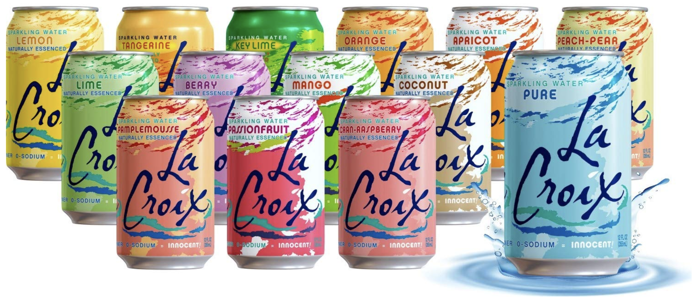
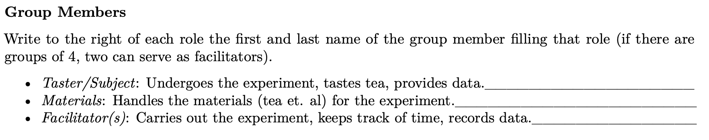
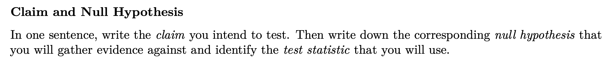
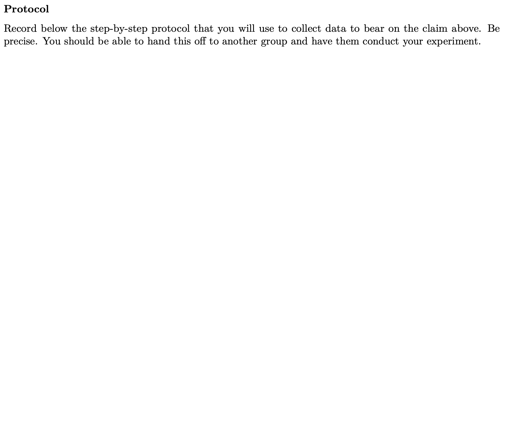

```{r setup, include=FALSE}
knitr::opts_chunk$set(message = FALSE,
                      warning = FALSE,
                      echo = FALSE,
                      fig.align = "center",
                      fig.retina = 3)

library(tidyverse)
library(xaringanthemer)
```

class: center, middle

# Welcome to Lab!

---

class: center, middle

# Day 1

Please get into groups of 3 (4 is ok too). Take turns introducing yourselves.
These will be your partners for Questions 1 and 2.

---

class: center, middle

# Question 1 - Setting up your experiment

-  Have a group member with a tablet write your answers on a digital version of this document, or have a group member write your answers on a scanned version of the paper document.

- Your answers to this question, along with your answers to Question 2 will be submitted as a *group submission* to *Lab 5 - Group Portion* on Gradescope.

- Work at your own pace today. The recommended times are there to help you out. We will come by and guide you where necessary.

---

## Lab 5

**Your challenge this week**: Determine whether or not one of your group members can distinguish between two different types of sparkling water (or a similar claim *of your choosing*). 

---

## Lab 5 - Logistics

.pull-left[
```{r echo= FALSE}

```
]

.pull-right[

### Each team will have

- 50 minutes (lab Wednesday)
- 2 cans of sparkling water, each one from a different flavor
- small cups
- straws
- saltine crackers
]

---

## Group Members

```{r}

```

--

-   Choose a Taster, a Materials Handler, and one (two) facilitator(s).

---

## Claim and Hypotheses (rec. 10 mins)

```{r}

```

- **Remember from Week 1**: Your question directly influences the data you will collect! Be specific enough that you can envision a data frame that will record your experiment data based off of your question.

---

## Protocol (rec 20 mins.)

-   Be specific! You *must* be able to pass this protocol off to another group so they could carry out your intended experiment with no confusion.

```{r}

```

---

## Data (rec 10 mins.)

```{r}
knitr::include_graphics("assets/images/data.png")
```


---

## Graphics (rec 10 mins.)

```{r}
knitr::include_graphics("assets/images/eda.png")
```

---

## Things to remember

- Be precise in your protocol.

- For Wednesday's lab, meet outside Evans Hall.

---

# End of Day 1

--- 

# Day 2

Spent outside of the classroom.

---

# Day 3

---

# Question 3

---

## Question 3

-   Today, you guys will be working with your datasets you compiled from your experiments on Wednesday!

--

-   This is an *individual assignment* and will be submitted separately as such, so please make sure your write-ups are your own. 

---

## Question 3 subquestion 1 (10 mins)

1. Create a data frame based on the data you collected and print it out into your pdf. You can print all rows your data frame using `print(my_tibble, n = nrow(my_tibble))`.

---

## Question 3 subquestion 2 (5 mins)

2. Create a visualization of the data you collected (not the null distribution) similar to the one you sketched in the handout. Does it look clearly in support of your claim or contrary to your claim or somewhere in between?

---

## Question 3 subquestion 3 (20 mins)

3. Conduct a hypothesis test to determine whether your data is consistent with the null hypothesis. Be sure to provide.

    a. The null and alternative hypotheses.
    
    b. The value of the observed test statistic.
    
    c. A visualization of the null distribution and observed test statistic with the p-value shaded in.
    
    d. The p-value and your conclusion (use $\alpha = .05$) regarding null hypothesis and original claim.
    
---

# End of Day 3
